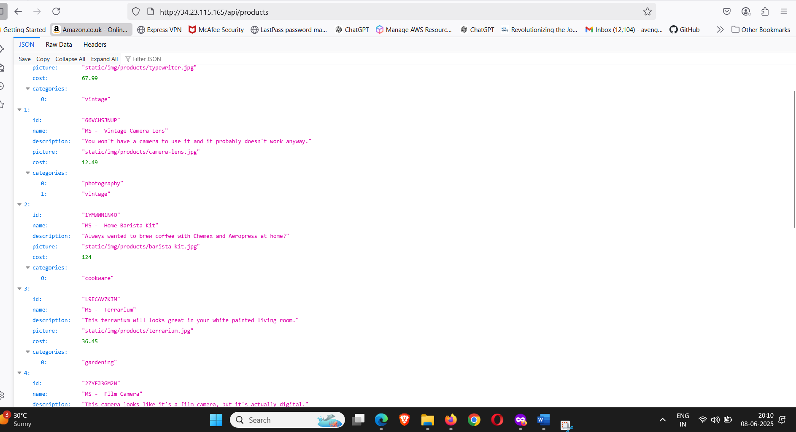
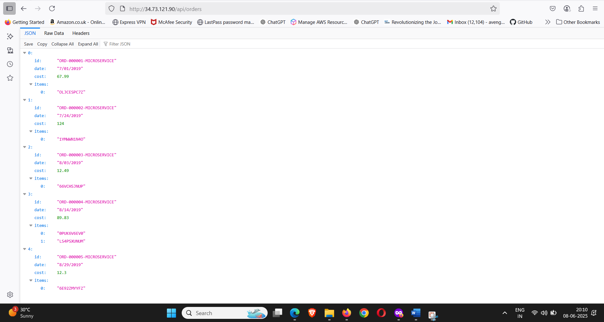
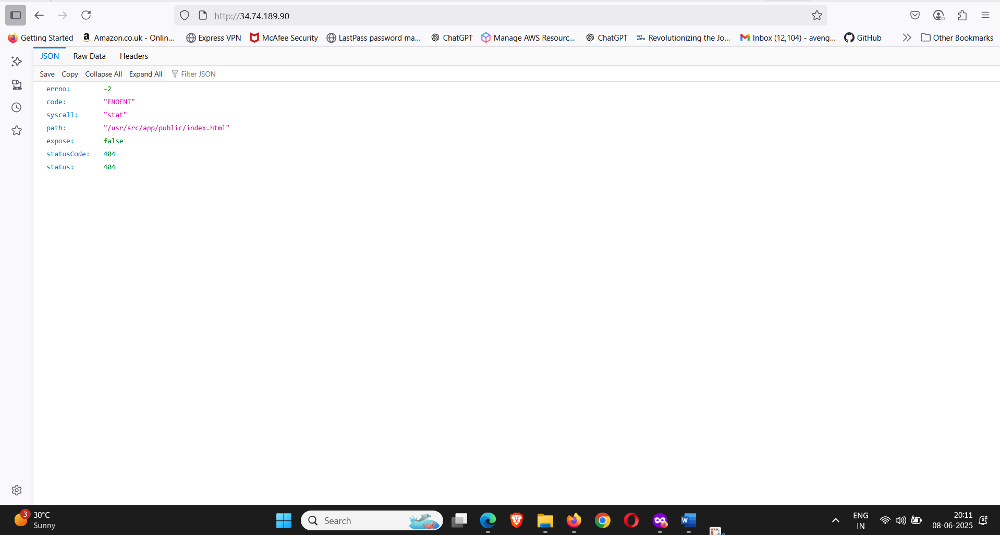
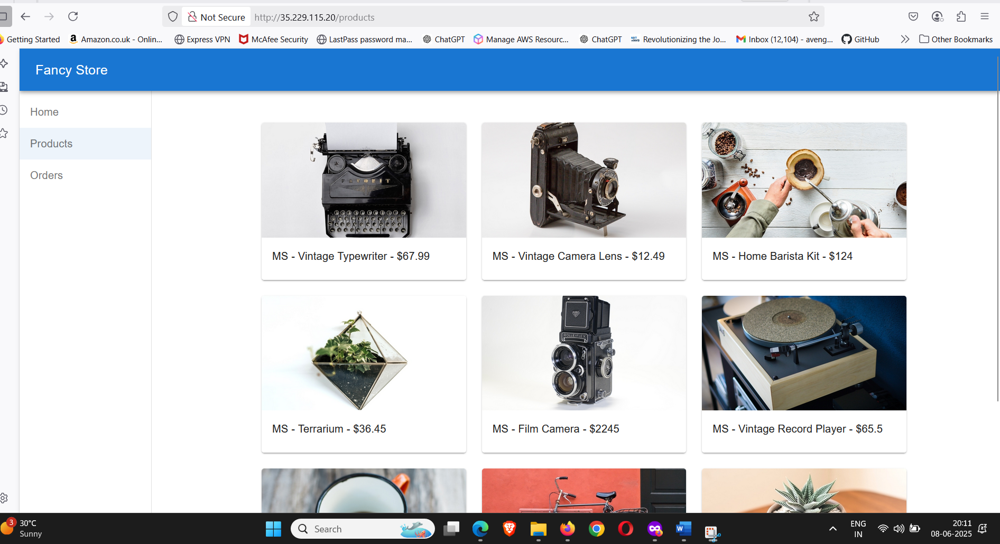
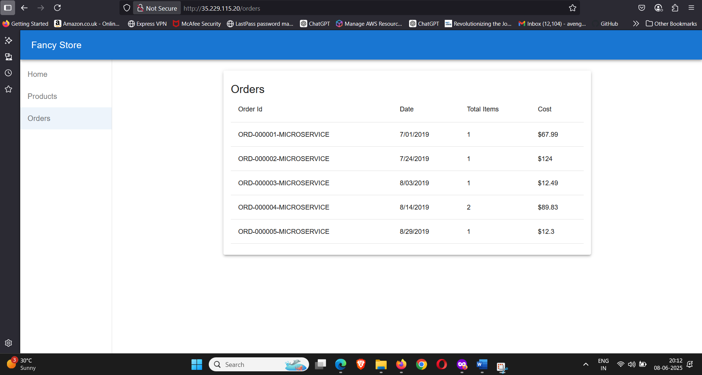
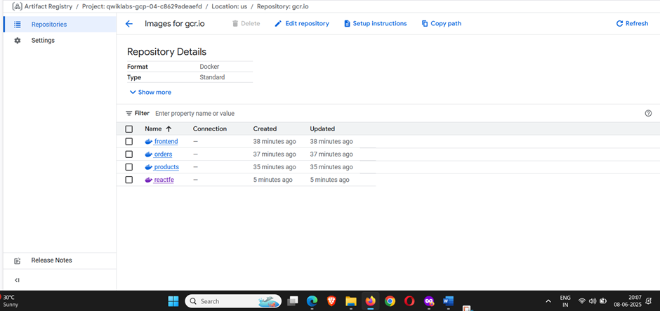
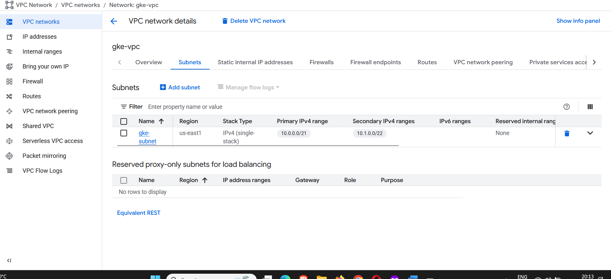
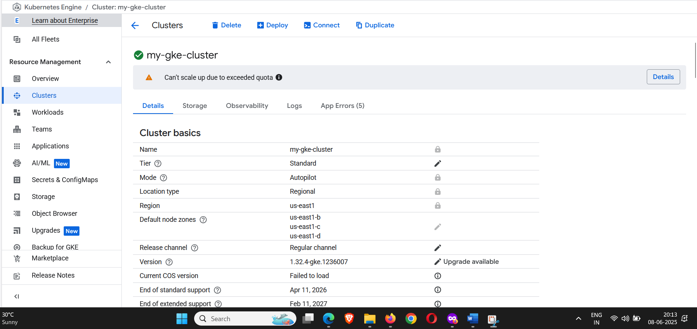
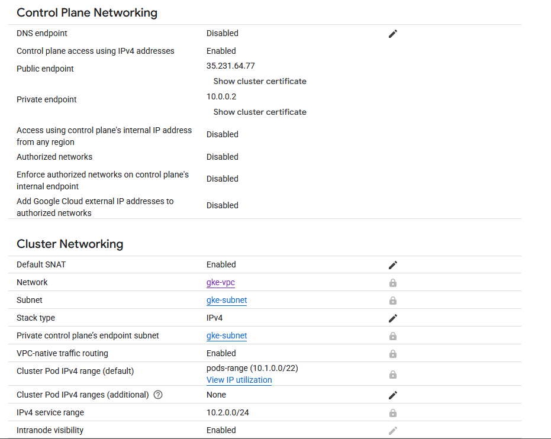

# Monolith to Microservices
### Steps to deploy this microservices i.e frontend , orders, products and reactjs based frontend on gcp gke with VPC-native clusters.


### step by step procedure to deploy microservices project in gcp gke 

### create a vpc with appropriate subnets and secondary and primary ip for pods and services
# if you want complete range to be occupied then use below cli
``` 
# Create VPC
gcloud compute networks create gke-vpc --subnet-mode=custom

# Create subnet with secondary ranges
gcloud compute networks subnets create gke-subnet \
  --network=gke-vpc \
  --range=10.0.0.0/16 \
  --region=us-west1 \
  --secondary-range=pods-range=10.1.0.0/17,services-range=10.2.0.0/20

# Create GKE cluster
gcloud container clusters create-auto my-gke-cluster \
  --region=us-west1 \
  --network=gke-vpc \
  --subnetwork=gke-subnet \
  --cluster-secondary-range-name=pods-range \
  --services-secondary-range-name=services-range
```
# if limited number of ips are desired use below cli
```
gcloud compute networks create gke-vpc --subnet-mode=custom

gcloud compute networks subnets create gke-subnet \
  --network=gke-vpc \
  --range=10.0.0.0/21 \
  --region=us-west1 \
  --secondary-range=pods-range=10.1.0.0/22,services-range=10.2.0.0/24

gcloud container clusters create-auto my-gke-cluster \
  --region=us-west1 \
  --network=gke-vpc \
  --subnetwork=gke-subnet \
  --cluster-secondary-range-name=pods-range \
  --services-secondary-range-name=services-range
``` 
### pushing docker images to registry

```
gcloud services enable containerregistry.googleapis.com
gcloud auth configure-docker
docker tag dockerimgid gcr.io/qwiklabs-gcp-02-13d47b97d07a/frontend:v1
docker push gcr.io/qwiklabs-gcp-02-13d47b97d07a/frontend:v1
docker tag 4030cd5bd5c4 gcr.io/qwiklabs-gcp-02-13d47b97d07a/products:v1
docker push gcr.io/qwiklabs-gcp-02-13d47b97d07a/products:v1
docker tag 79fcc56345ba gcr.io/qwiklabs-gcp-02-13d47b97d07a/orders:v1
docker push gcr.io/qwiklabs-gcp-02-13d47b97d07a/orders:v1
docker build -t gcr.io/qwiklabs-gcp-04-c8629adeaefd/reactfe:v1 
docker tag f2a8f0f33804   gcr.io/qwiklabs-gcp-04-c8629adeaefd/reactfe:v1
docker push gcr.io/qwiklabs-gcp-04-c8629adeaefd/reactfe:v1
```
```
docker tag imageid frontend
```
### once cluster is created hit following command you get this command from gke as well
```
gcloud container clusters get-credentials my-gke-cluster --region us-central1 --project qwiklabs-gcp-02-d4016954c983
```
# k8s commands usefull in this deployment 
```
kubectl apply -f namespace.yml
kubectl apply -f frontend.yml
kubectl apply -f orders.yml
kubectl apply -f products.yml
kubectl get pods -n frontend
kubectl get pods -n orders
kubectl get pods -n products
kubectl get pods -n reactfe
kubectl get svc -n reactfe
kubectl get deployment -n reactfe
kubectl get pods --all-namespaces
kubectl config current-context #for cluster configuration troubleshooting
gcloud container clusters list #for cluster troubleshooting 
gcloud container clusters describe my-gke-cluster --region us-west1 --format="value(autopilot.enabled)" #to get either ur cluster is autopilot or standard
kubectl get deployments -n frontend
kubectl get svc -n frontend
```

### final deployment snips
### products api 

### orders api

### frontend api

### frontend react app product page 

### frontend react app orders page

### a  VPC native cluster is created as well with subnet having primary and secondary ip for pod and services
  
### kubernetes cluster created in autopilot mode instead of standard mode

### control plane networking details of clusters

### clusters networking details


### setting up pod security.
```
kubectl label namespace reactfe \
  pod-security.kubernetes.io/enforce=restricted \
  pod-security.kubernetes.io/audit=baseline \
  pod-security.kubernetes.io/warn=baseline
```


----------------------------------------------------------------------------------------------------------------------

## NOTE: This is not an officially supported Google product

## Introduction

### This project is used by the Google Cloud Platform team to demonstrate different services within Google Cloud. This project contains two versions of the same application, one architected as a monolith and the other as a set of microservices

## Setup

### **NOTE:** Make sure you have a newer version of NodeJS (16.13.0) or newer (in Cloud Shell you can run `nvm install --lts`)

```bash
git clone https://github.com/googlecodelabs/monolith-to-microservices
cd monolith-to-microservices
./setup.sh
```

## Monolith

### To run the monolith project use the following commands from the top level directory

```bash
cd monolith
npm start
```

You should see output similar to the following

```text
Monolith listening on port 8080!
```

#### That's it! You now have a perfectly functioning monolith running on your machine

### Docker - Monolith

#### To create a Docker image for the monolith, execute the following commands

```bash
cd monolith
docker build -t monolith:1.0.0 .
```

To run the Docker image, execute the following commands

```bash
docker run --rm -p 8080:8080 monolith:1.0.0
```

## Microservices

### To run the microservices project use the following commands from the top level directory

```bash
cd microservices
npm start
```

You should see output similar to the following

```text
[0] Frontend microservice listening on port 8080!
[2] Orders microservice listening on port 8081!
[1] Products microservice listening on port 8082!
```

### That's it! You now have a perfectly functioning set of microservices running on your machine

### Docker - Microservices

### To create a Docker image for the microservices, you will have to create a Docker image for each service. Execute the following commands for each folder under the microservices folder

```bash
cd microservices/src/frontend
docker build -t frontend:1.0.0 .

cd ../products
docker build -t products:1.0.0 .

cd ../orders
docker build -t orders:1.0.0 .
```

To run the Docker image, execute the following commands

```bash
docker run -d --rm -p 8080:8080 monolith:1.0.0
docker run -d --rm -p 8081:8081 orders:1.0.0
docker run -d --rm -p 8082:8082 products:1.0.0
```

#### To stop the containers, you will need to find the CONTAINER ID for each and stop them individually. See the steps below

```bash
docker ps -a

CONTAINER ID        IMAGE                        COMMAND                CREATED
4c01db0b339c        frontend:1.0.0               bash                   17 seconds ago
d7886598dbe2        orders:1.0.0                 bash                   17 seconds ago
d85756f57265        products:1.0.0               bash                   17 seconds ago

docker stop 4c01db0b339c
docker stop d7886598dbe2
docker stop d85756f57265
```

## React App

### The react-app folder contains a React application created from `create-react-app`. You can modify this fronted, but afterwards, you will need to build and move the static files to the monolith and microservices project. You can do this by running the standard create-react-app build command below

```bash
npm run build
```

#### This will run the build script to create the static files two times. The first will build with relative URLs and copy the static files to the monolith/public folder. The second run will build with the standard microservices URLs and copy the static files to the microservices/src/frontend/public folder
