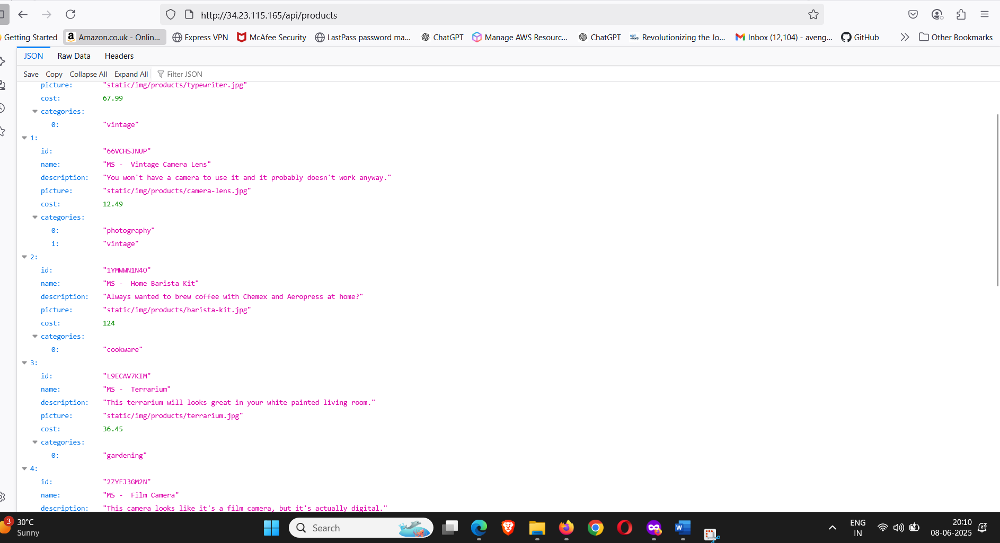
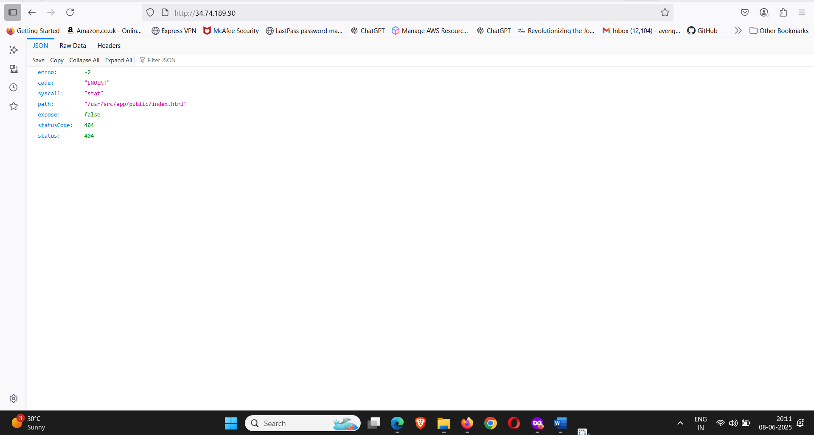
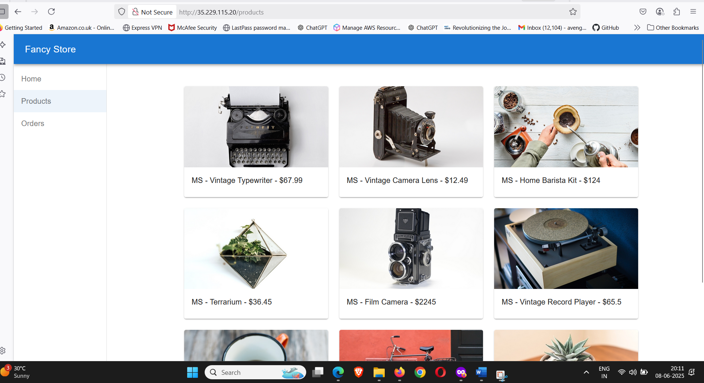
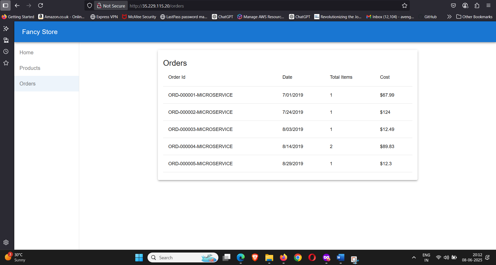
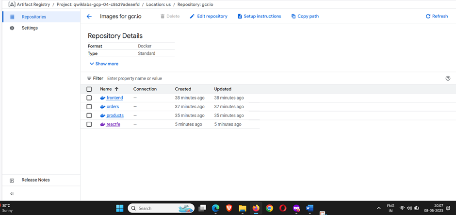
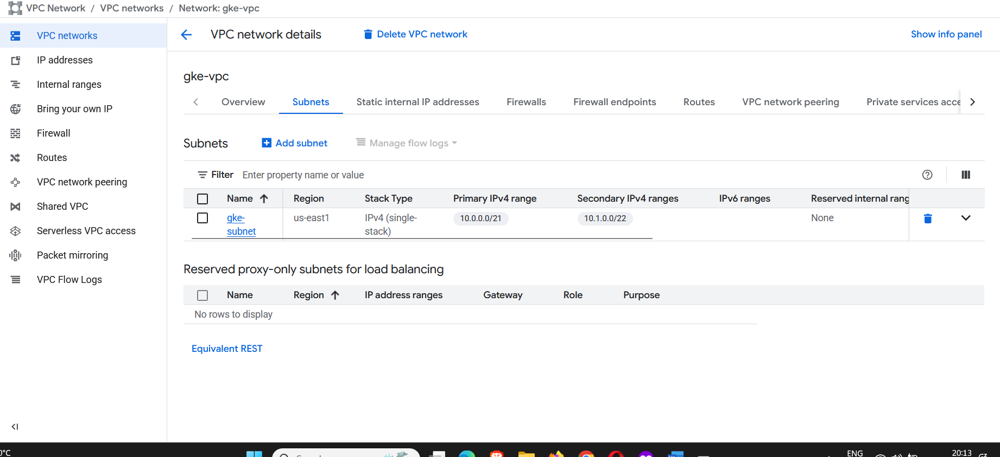
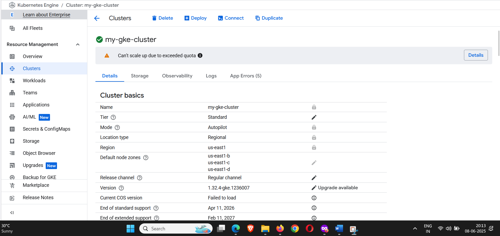
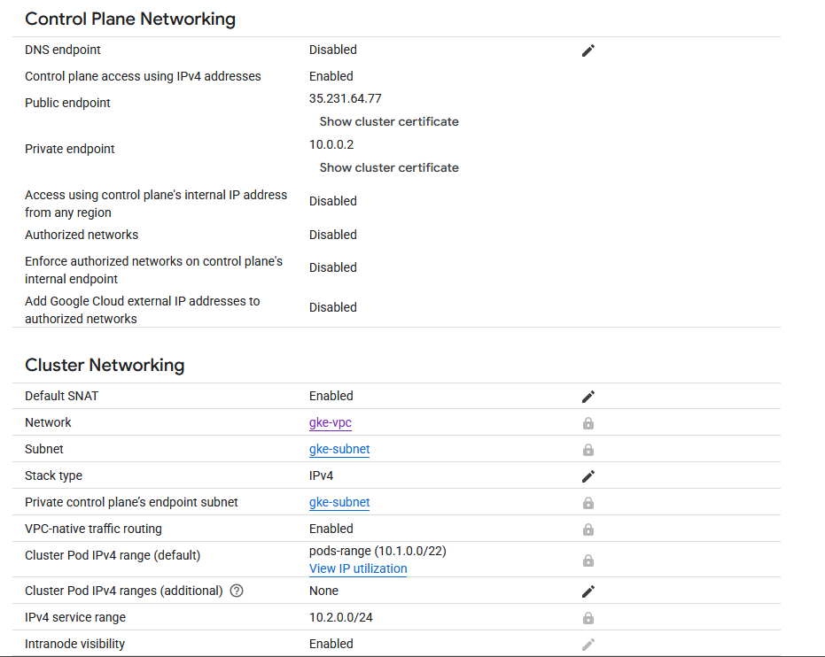

### step by step procedure to deploy microservices project in gcp gke 

### create a vpc with appropriate subnets and secondary and primary ip for pods and services
# if you want complete range to be occupied then use below cli
``` 
# Create VPC
gcloud compute networks create gke-vpc --subnet-mode=custom

# Create subnet with secondary ranges
gcloud compute networks subnets create gke-subnet \
  --network=gke-vpc \
  --range=10.0.0.0/16 \
  --region=us-west1 \
  --secondary-range=pods-range=10.1.0.0/17,services-range=10.2.0.0/20

# Create GKE cluster
gcloud container clusters create-auto my-gke-cluster \
  --region=us-west1 \
  --network=gke-vpc \
  --subnetwork=gke-subnet \
  --cluster-secondary-range-name=pods-range \
  --services-secondary-range-name=services-range
```
# if limited number of ips are desired use below cli
```
gcloud compute networks create gke-vpc --subnet-mode=custom

gcloud compute networks subnets create gke-subnet \
  --network=gke-vpc \
  --range=10.0.0.0/21 \
  --region=us-west1 \
  --secondary-range=pods-range=10.1.0.0/22,services-range=10.2.0.0/24

gcloud container clusters create-auto my-gke-cluster \
  --region=us-west1 \
  --network=gke-vpc \
  --subnetwork=gke-subnet \
  --cluster-secondary-range-name=pods-range \
  --services-secondary-range-name=services-range
``` 
### pushing docker images to registry

```
gcloud services enable containerregistry.googleapis.com
gcloud auth configure-docker
docker tag dockerimgid gcr.io/qwiklabs-gcp-02-13d47b97d07a/frontend:v1
docker push gcr.io/qwiklabs-gcp-02-13d47b97d07a/frontend:v1
docker tag 4030cd5bd5c4 gcr.io/qwiklabs-gcp-02-13d47b97d07a/products:v1
docker push gcr.io/qwiklabs-gcp-02-13d47b97d07a/products:v1
docker tag 79fcc56345ba gcr.io/qwiklabs-gcp-02-13d47b97d07a/orders:v1
docker push gcr.io/qwiklabs-gcp-02-13d47b97d07a/orders:v1
docker build -t gcr.io/qwiklabs-gcp-04-c8629adeaefd/reactfe:v1 
docker tag f2a8f0f33804   gcr.io/qwiklabs-gcp-04-c8629adeaefd/reactfe:v1
docker push gcr.io/qwiklabs-gcp-04-c8629adeaefd/reactfe:v1
```
```
docker tag imageid frontend
```
### once cluster is created hit following command you get this command from gke as well
```
gcloud container clusters get-credentials my-gke-cluster --region us-central1 --project qwiklabs-gcp-02-d4016954c983
```
# k8s commands usefull in this deployment 
```
kubectl apply -f namespace.yml
kubectl apply -f frontend.yml
kubectl apply -f orders.yml
kubectl apply -f products.yml
kubectl get pods -n frontend
kubectl get pods -n orders
kubectl get pods -n products
kubectl get pods -n reactfe
kubectl get svc -n reactfe
kubectl get deployment -n reactfe
kubectl get pods --all-namespaces
kubectl config current-context #for cluster configuration troubleshooting
gcloud container clusters list #for cluster troubleshooting 
gcloud container clusters describe my-gke-cluster --region us-west1 --format="value(autopilot.enabled)" #to get either ur cluster is autopilot or standard
kubectl get deployments -n frontend
kubectl get svc -n frontend
```

### final deployment snips
### products api 

### orders api
 
### frontend api

### frontend react app product page 

### frontend react app orders page
 
### a  VPC native cluster is created as well with subnet having primary and secondary ip for pod and services
  
### kubernetes cluster created in autopilot mode instead of standard mode
 
### control plane networking details of clusters
 
### clusters networking details
 
